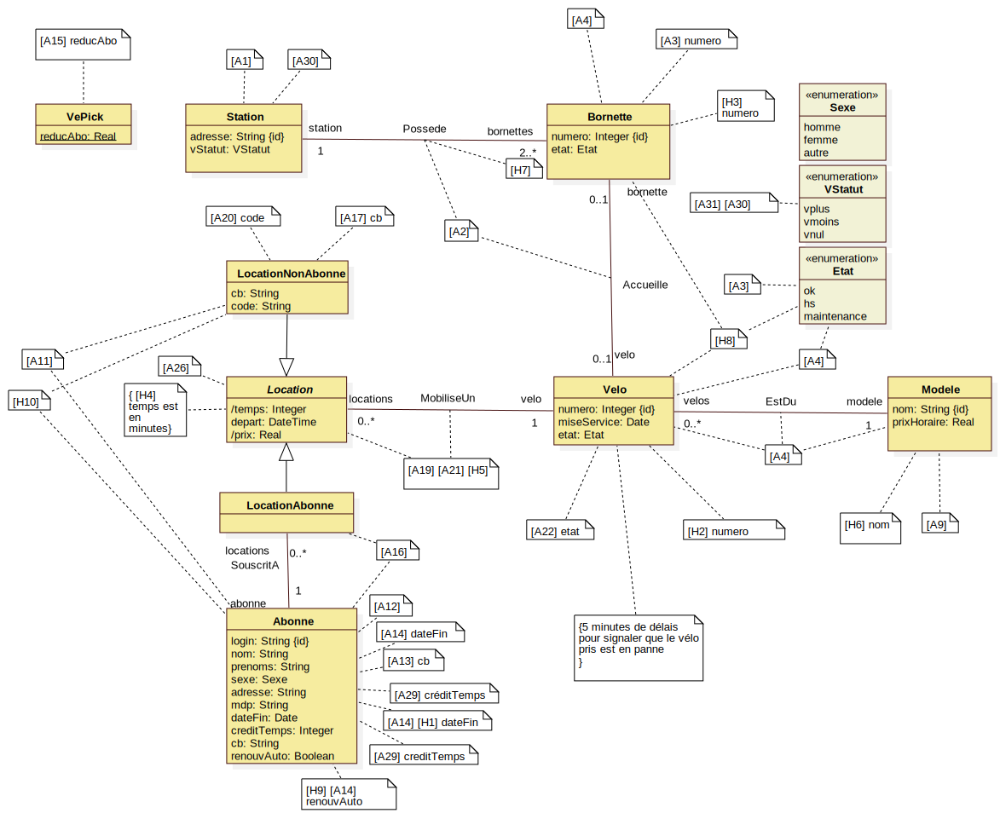
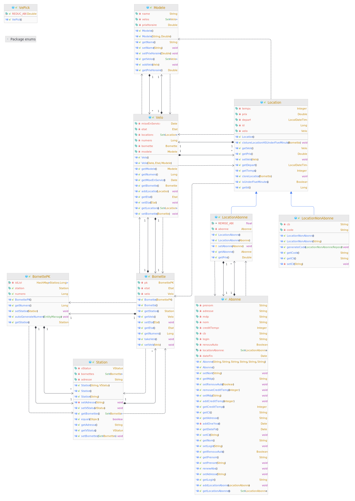
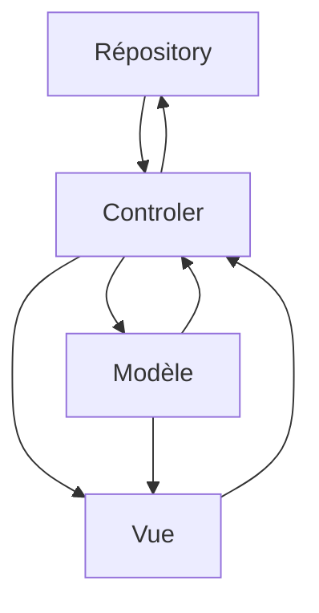
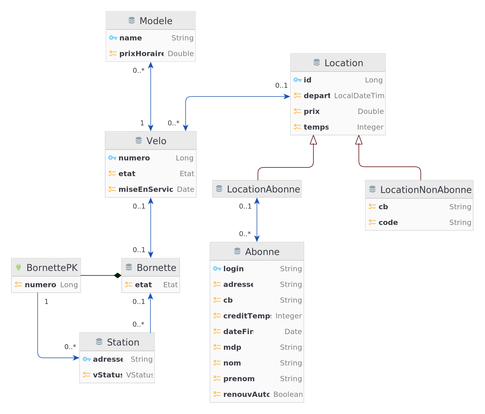

# Rapport Projet VéPick
Code sources disponibles sur [Github](https://github.com/mrsolarius/ProjetBDD)

Membres du projet :
* *Adam MOUSSOLNA*
* *Julien TURC*
* *Louis VOLAT*
* *Lucas ZAETTA*
* *Hubert ZODJIHOUE*

```
@todo indiquer l'avancement du projet
@todo présenter nos scénarios de test
@todo présenter notre peuplement de données et nos testes
@todo discuter de nos choix de modélisation conceptuelle
@todo retour critique sur notre travail
```

## Objectifs du projet
 Le but du projet était de développer un système de gestion de vélos partagés similaire à ceux utilisés par Velo'v à
 Lyon ou Vélib à Paris. Ce système devait permettre à n'importe quel usager de louer simplement un vélo afin de se
 déplacer dans Salem et Groville. Le système doit être simple, rapide, efficace et accessible à tous.

Pour réaliser cette application, nous avons utilisé Java et le framework JPA, ainsi que le moteur de base de données 
MariaDB pour le développement. En effet, la mise en production avec Oracle posait des problèmes au niveau de la 
connexion ainsi qu'au niveau de l'identification avec JPA. Afin de nous simplifier la tâche, nous
avons développé notre interface homme-machine directement en console.
```
@todo rappeler brièvement l'organisation du document
```
## Déroulement du projet
Pour réaliser ce projet, nous sommes passés par plusieurs phases de développement. 

Nous avons débuté ce projet par une phase de comprehension du besoin du client (Vépick).
Au cours de cette phase, nous avons mis en place un glossaire permettant de bien définir les termes présentés par
le client. Cette phase, nous a pris environ 4 heures.

Puis, à partir de notre compréhension de ces besoins, nous avons poursuivi par une phase de définition
du modèle conceptuel de données. Ce modèle de données a beaucoup évolué au cours de cette phase.
C'est également lors de cette phase que nous avons émis des hypothèses sur les besoins de l'utilisateur, que nous avons
alors répertoriés dans un document. Cette phase nous a pris environ 8 heures.

Nous sommes ensuite entrés dans une phase d'implémentation de notre modèle conceptuel de données. C'est dans cette phase
que nous avons mappé nos classes avec JPA. Une fois cette phase effectuée, nous avons pu réaliser un schéma de mapping JPA puis
nous avons généré notre modèle de données. Cette phase nous a pris environ 2 heures.

Nous avons ensuite commencé la phase de développement. Nous avons commencé par nous répartir différentes
tâches (sous la forme de vues qui permettaient des actions précises) et à développer celles-ci. Cependant, au terme d'une
semaine de développement, nous nous sommes rendu compte qu'une partie non négligeable du code était redondant (les mêmes
fonctionnalités avaient été implémentées plusieurs fois dans plusieurs classes différentes). En conséquence, nous avons dû
réorganiser notre développement. Cette réorganisation a pris la forme d'une nouvelle phase de conception plus théorique.

Une fois notre vision fonctionnelle claire, nous sommes à nouveau entrés dans une phase de développement. Cette fois 
avec bien plus de recul et d'aplomb.

## Organisation du projet et répartition des tâches
 Pendant les phases de conception, nous nous sommes tous réunis afin de réfléchir ensemble et de 
nous accorder sur la conceptualisation de notre modèle de données. 

 Par la suite, nous avons réparti le travail dans des "issues" sur notre projet github. Chaque "issue" était alors attribuée 
à une ou deux personnes maximum. Pour correctement répartir les tâches et éviter les conflits, nous avons utilisé
les interfaces java afin de répartir le travail entre ceux qui utilisent et spécifient les interfaces et ceux qui les
implémentent. De cette façon, nous avons pu nous répartir le travail entre la mise en place de la vue, celle
des repository et celle des contrôleurs.

## Fonctionalités réalisées
Nous avons réalisé les fonctionnalités suivantes :
1. Emprunt de vélos Cf. _[B1], [B2]_ \
   Dans notre interface nous demmandons à l'usager de séléctionner une station puis une fois sur la station il se retrouve
   face à une vue de station lui proposant d'emprunter un vélo. Il peut alors indiquer si il et abonnée ou non et ainci
   récupérer un vélo à une bornette. Ici tous les type de cas d'erreur possible sont gérer
2. Rendu d'un vélo  Cf. _[B3], [B4], [B5], [B6]_ \
   Dans notre interface, nous demandons à l'usager de sélectionner une station puis une fois sur la station il se retrouve
   face à une vue de station lui proposant de rendre un vélo. Il peut alors indiquer s'il est abonné ou non.
   une fois indiqué, le système demande à l'utilisateur l'état du vélo. S'il est HS, deux cas se présentent :
-la location a démarré il y a moins de 5 minutes : le client n'est pas débité la location est annulée.
-la location a démarré il y a plus de 5 minutes : le client paye normalement.
Dans les deux cas, le vélo est enregistré comme HS.
3. L'abonnement au service Cf. _[B7] \
   Ici notre interface propose à l'utilisateur de s'abonner au service et grâce à l'interface textuelle, il peut simplement
   le faire sans aucun souci.

Nous avons donc réalisé les fonctionnalités obligatoires de l'application.

## Choix de modélisation et évolution entre les deux rapports
L'un des points névralgiques de nos discussions était sur la représentation d'une location d'un vélo par un client. Nous avions
initialement pensé à une classe associative "Location" entre la classe "Client" et la classe "Vélo". Les classes "Abonne" et "NonAbonne"
héritant toutes les deux de "Client" et les classes "LocationAbonne" et "LocationNonAbonne" héritant de "Location". Cela semblait être la
modélisation "naïve" en lisant l'énoncé du projet. Ce choix n'avait finalement pas beaucoup de sens dans la mesure où un client non abonné
n'existe pas avant ni après la location non abonné. Tous les attributs d'un client non abonné peuvent donc être stokés dans la classe
"LocationNonAbonne" et le système ne va pas conserver de trace de clients anonymes.

En outre, nous n'avons pas apporté de modification supplémentaire au modèle conceptuel depuis le rapport intermédiaire.
Nous avions passé suffisamment de temps en amont pour partir directement sur une piste qui nous satisfaisait. 
e fait de ne pas avoir eu besoin de toucher à notre modèle conceptuel est un point positif. Car cela implique que notre
conception été suffisamment réfléchie pour nous permettre de réaliser tous les scenarios obligatoires du projet.

### Modèle conceptuel de données
Voici donc notre modèle conceptuelle de donnée :
À noter que chaque [XX] fait référence à une phrase du texte ou à une de nos hypothèses en annexes.



### Implementation JPA

### Implementation JAVA

#### Modele JAVA
Nous avons également beaucoup travaillé sur l'implémentation du modèle java en réalisant des getter,setter et add aux endroits où cela était nécessaire.
Aussi nous avons beaucoup réfléchi à la bonne manière de conserver notre double associativité. Et nous avons tenté 
de placer le plus de méthodes métier spécifiques directement dans le modèle.

Il a été nécessaire de mettre en place nous-même l'auto-génération des clés primaire pour la clés composites de
BornettePK qui parts de 0 pour chaque nouvelle station.

Le calcule du prix de la location à était géré par une méthode abstraite réimplementée pour chaque type de location
et appelée à la cloture de la location. 

Certaines doubles associations ne sont pas modifible une fois crée. C'est par exemple le cas de l'association entre "location"
et "vélo" ou encore celle entre "location abonné" et "abonné."

Voici donc le diagramme de classe du modèle de notre applicatif.



#### Structure global de l'application

Pour réaliser cette application, nous avons pris le parti d'organiser ce projet en MVCR (Modèle Vue Controler Répository).
Ce schema de conception s'implémente chez nous de façon assez particulière car la vue n'a pas le droit de modifier le modèle. Pour toute action
du modèle, il est obligatoire d'utiliser les controleurs. 

Cela nous a permis de plus facilement nous répartir le travail en proposant aux personnes implémentants la vue de les 
créer en utilisant des méthodes de controleur non implémenté à ce moment-là. 

Ainsi, notre développement s'est dirigé vers la vue. En effet se sont les personnes chargées de la création des vues qui dictaient
ce qu'elles s'attendaient à envoyer et à recevoir via des interfaces de controleurs implémenter plus tard. 

Enfin les controleurs ne sont pas autorisés à accéder directement à la BDD en effet leurs seules actions possibles et de 
préparer les transactions, utiliser les repository et le commit. De cette manière notre travail est une fois de plus 
réparti et nous permet d'implémenter plusieurs fonctionnalités simultanément.



## Scénario de test
Afin de nous simplifier la vie et de tester tout ce qui peut être testé dans l'application, nous avons créé un sénario 
permettant de tester chaque fonctionnalité de l'application de façon indépendante. Et facilement réutilisable.
Voici donc notre sénario de test :

### Première Étape

* Insertion des données pour remplir la BD

### Deuxième Étape

* Création d'un premier compte Abonné
   * login : **Squeezie**
   * nom : Hauchard
   * prenom : Lucas
   * adresse : 3 Rue des Potiers
   * mdp : 1234
   * cb : 1879456121300145

* Création d'un second compte Abonné
   * login : **Squeezie** **-> erreur**
   * login : **Vanir**
   * nom : Zaetta
   * prenom : Lucas
   * adresse : 5 Avenue Alsace Allemande
   * mdp : 666
   * cb : 7451254785443210

### Troisième Étape

* Choix de la station X	(12 place felix poulat 38000)

   * cette station a toutes ses bornettes vides, à l'exception de 2 bornettes
      * la première est **HS**
      * la deuxième est **OK** mais possède un **vélo HS**
   * **-> info d'emprunt impossible car station vide**

* Choix de la station Y (19 rue paul janet 38000)

   * cette station a plusieurs vélos disponibles
      * on emprunte un vélo en tant que **non abo**
         * cb -> 1111111121111111
      * on emprunte un vélo en tant que **non abo**
         * cb -> 1111111121111111
      * on emprunte un vélo en tant qu'**abo**
         * Connexion -> Squeezie / 1234
      * on emprunte un vélo en tant qu'**abo**
         * Connexion -> Vanir / 666

* Choix  de la station Z (7 rue des invalides 38000)

   * Cette station est remplie de vélos

      * on emprunte un vélo en tant qu'**abo**
         * Connexion -> Squeezie / 1234

      * On emprunte un vélo en tant que **non abo**
         * cb -> 2222222322222222

### Quatrième Étape

* Choix de la station Y (19 rue paul janet 38000)

   * on rend un vélo en tant qu'**abo**
      * Connexion Squeezie / 1234
      * affichage de son vélo
      * il le choisit
      * le vélo est HS (- de 5 minutes)
      * FIN

   * on rend un vélo en tant que **non abo** (différent du premier)
      * rentre son code
      * le vélo est HS (- de 5 minutes)
      * FIN

### CINQUIEME ÉTAPE

* Choix de la station Y (19 rue paul janet 38000)
   * on rend un vélo en tant qu'**abo**
      * Connexion Squeezie / 1234
      * affichage de ses 2 vélos
      * il en choisit un
      * le vélo est OK
      * l'abo paie
      * FIN

* Choix de la station Z (7 rue des invalides 38000)

   * on rend un vélo en tant que **non abo**
      * rentre son code
      * Le vélo est OK
      * le non abo paie
      * FIN

   * on rend un vélo en tant que **non abo**
      * rentre son code
      * le vélo est HS (5 minutes ou +)
      * le non abo paie
      * FIN
   * on rend un vélo
      * **-> retour impossible car station pleine**

* Choix de la station X (12 place felix poulat 38000)

   * on rend un vélo en tant qu'**abo**
      * Connexion Vanir / 666
      * affichage de son vélo
      * il le choisit
      * le vélo est HS (5 minutes ou +)
      * l'abo paie
      * FIN
   

## Test réalisés

Afin d'assurer le fonctionnement parfait de notre modèle sur sa partie critique, à savoir la location et la gestion des
abonnées. Nous avons réalisé quelques tests unitaires s'assurant du bon fonctionnement de la double association entre les classes.
Ainsi que du fonctionnement de l'emprunt et du rendu de vélo.

Nous avons également tout au long du projet spécifié et séparé au mieux notre code dans le but de le rendre le plus lisible 
possible et le moins compliqué à débugger.

Aussi, à chaque étape de l'implémentation, des tests d'intégration ont été réalisés manuellement pour s'assurer du 
bon fonctionnement des tests les uns avec les autres.

## Conclusion

    La partie obligatoire du cahier des charges a été respectée. L'implémentation des fonctionnalités optionnelles nous
aurait probablement pris une semaine de cours supplémentaire. Nous estimons qu'il nous faudrait environ huit heures de
plus. En ce qui concerne les jeux de test, bien qu'ils couvrent tous les cas basiques de l'utilisation du projet, ils
mériteraient probablement également quelques ajouts. Globalement ce projet nous aura permis de mobiliser des compétences
multiples, tant bien techniques qu'organisationnelles.


## Annexe 1: Glossaire
### A

#### Abonné

Cf. _[A12] [A15]_\
Un abonné est un **[usager](#usager)** ayant acheté un **[abonnement](#abonnement)** valable. Ses informations personnelles sont
enregistrées, et il bénéficie d’une réduction de **[location](#location)** et s'identifie grâce à son **[mot de passe](#mot-de-passe)**.

#### Abonnement

Cf. _[A14]_\
Un abonnement permet à un **[usager](#usager)** d'effectuer des **[locations](#location)** avec plus de facilités et
avec un tarif reduit.

### B

#### Borne

Cf. _[A22]_\
Une **[borne](#borne)** est un équipement qui permet à l'**[usager](#usager)** d'interagir avec VéPick afin d'effectuer
la **[location](#location)** d'un vélo. C'est l'intermédiaire entre l'**[usager](#usager)** et la **[station](#station)**.

#### Bornette

Cf. _[A2] [A3]_\
Emplacement d’une **[station](#station)** pouvant héberger un **[vélo](#vélo)**.

### C

#### Code

Cf. _[A16] [A20]_\
Un **[code](#code)** est un identifiant unique qui permet à chaque **[usager](#usager)** **[non abonné](#non-abonné)** de s’identifier afin de remettre une **[location](#location)** à une **[station](#station)**.

#### Crédit-temps

Cf. _[A28] [A29]_\
Le **[crédit-temps](#crédit-temps)** est un compte de minutes déductibles du temps de **[location](#location)**.
Il est crédité d'une minute à chaque fois qu'un **[abonné](#abonné)** a effectué
une **[location](#location)** qui participe au système de **[régulation citoyenne](#régulation-citoyenne)**

### E

#### État

Cf. _[A4] [[H8]](hypothèse.md#h8-Hypothèse-8)_\
Un **[vélo](#vélo)** et une **[bornette](#bornette)** ont forcément un état, OK s'ils sont en état de fonctionner ou HS en cas de problème technique signalé. Ils peuvent également avoir comme état "maintenance" s'ils sont en maitenance (parce qu'ils étaient HS / pour révision).

### L

#### Location

Cf. _[A20] [A21] [A26]_\
Une **[location](#location)** est définie par une date de départ, un temps de location et un prix.
Elle permet à un **[usager](#usager)** de louer un **[vélo](#vélo)**.

#### Location Non Abonné

Cf. _[A20]_\
Une **[location non abonné](#location-non-abonné)** est définie par une date de départ, un temps de location,
un prix, un code de carte bleu et un **[code secret](#code)**. Elle permet à un **[usager](#usager)** **[non abonné](#non-abonné)** de louer un **[vélo](#vélo)**. Lorsqu'un **[usager](#usager)** non abonné loue un **[vélo](#vélo)**, il doit renseigner
son code de carte bleu. Une fois la transaction effectuée, le **[code](#code)** est délivré.

#### Location Abonné

Cf. _[A15] [A16] [A20] [A28] [A29]_\
Une **[location abonné](#location-abonné)** est définie par une date de départ un temps de location et un prix.
Elle permet à un **[usager](#usager)** **[abonné](#abonné)** de louer un **[vélo](#vélo)** plus facilement.
Ainsi que de bénéficier d’une réduction de location, et d'un **[crédit-temps](#crédit-temps)** grâce au système de **[régulation citoyenne](#régulation-citoyenne)**.

### M

#### Modèle

Cf. _[A4] [A9] [[H6]](hypothèse.md#h6-Hypothèse-6)_\
Le modèle d’un **[vélo](#vélo)** correspond à un type de vélo du parc VéPick, il est associé à un nom qui l'identifie [[H6]](hypothèse.md#h6-Hypothèse-6) et à un prix.

#### Mot De Passe

Cf. _[A12]_\
Le mot de passe permet à un **[abonné](#abonné)** de s'identifier.

### N

#### Non Abonné

Cf._[A20]_\
Un **[non abonné](#non-abonné)** est un **[usager](#usager)** qui n'a pas pris d'**[abonnement](#abonnement)**.

### R

#### Régulation Citoyenne

Cf. _[A28] [A29]_\
Le système de **[régulation citoyenne](#régulation-citoyenne)** permet à VePick d'assurer une disponibilité des vélos en remplissant les **[stations](#station)** sur lesquelles la demande est forte et inversement de laisser des **[bornettes](#bornette)** libres sur les **[stations](#station)** de destination. Ainsi chaque station se voit attribuer un statut **[VStatut](#vstatut)** correspondant à l'importance que l'algorithme de VePick devra apporter à chaque station. Ce système participatif se base sur un **[crédit-temps](#crédit-temps)** accordé à chaque **[abonné](#abonné)** lorsqu'il rend un **[vélo](#vélo)** sur une station définie par l'algorithme plutôt que sur sa station habituelle.

#### Station

Cf. _[A1] [A2] [A3]_\
Emplacement composé d'une **[borne](#borne)** elle-même constituée de plusieurs **[bornettes](#bornette)**, chacune pouvant héberger
un **[vélo](#vélo)**. La **[station](#station)** est située à une adresse précise.

### U

#### Usager

Cf. _[A12] [A15] [A16] [A20] [A21] [A26] [A28] [A29]_\
Un **[Usager](#usager)** est une personne qui utilise le service VéPick. Il peut être un **[abonné](#abonné)** ou un **[non abonné](#non-abonné)**.

### V

#### Vélo

Cf. _[A4]_\
Un **[vélo](#vélo)** (abréviation du mot _vélocipède_), est un véhicule terrestre à propulsion humaine entrant dans la catégorie des cycles et composé de deux roues alignées, qui lui donnent son nom. La force motrice est fournie par son conducteur (appelé « cycliste »), en position le plus souvent assise, par l'intermédiaire de deux pédales entraînant la roue arrière par une chaîne à rouleaux. Ici un **[vélo](#vélo)** a un numéro unique, une date de mise en circulation, ainsi qu’un **[état](#état)** et un **[modèle](#modèle)**.

#### VStatut

Cf. _[A27] [A28] [A29] [A30] [A31] [A32]_\
Le **[VStatut](#vstatut)** est le statut d'une **[station](#station)**. Il est défini manuellement par l'administrateur selon un planning. Il existe 3 statuts :

- VPlus : la station a besoin de plus de vélos
- VMoins : la station a besoin de moins de vélos
- VNul : la station n'a pas besoin spécifiquement de vélos

L'algorithme de VéPick va prioriser les **[stations](#station)** ayant un **[VStatut](#vstatut)** VPlus, en proposant à l'**[abonné](#abonné)** un **[crédit-temps](#crédit-temps)** s'il dépose son **[vélo](#vélo)** sur une **[station](#station)** ayant le **[VStatut](#vstatut)** VPlus.
De même l'algorithme de VéPick va vider les **[stations](#station)** ayant un **[VStatut](#vstatut)** VMoins, en proposant aux **[abonnés](#abonné)** un **[crédit-temps](#crédit-temps)** s'ils récupèrent leurs **[vélos](#vélo)** sur une **[station](#station)** ayant le **[VStatut](#vstatut)** VMoins.

## Annexe 2: Hypothèse
Ce fichier répertorie nos hypothèses discutées en réunion et utilisées pour générer notre modèle conceptuel.

### [H1] Hypothèse 1
Cf. *[A14]* \
On considère qu'un **[abonné](glossaire.md#Abonné)** est automatiquement lié à son **[abonnement](glossaire.md#Abonnement)**.
Le renouvellement de l'**[abonnement](glossaire.md#Abonnement)** est automatique. Un abonné peut toutefois choisir de désactiver le renouvellement automatique.
Cela veut dire que l'on considèrera ici une date d'expiration de l'**[abonnement](glossaire.md#Abonnement)** directement dans l'**[abonné](glossaire.md#Abonné)**.
Si l'**[abonné](glossaire.md#Abonné)** a choisi de désactiver son renouvellement, une fois la date de son **[abonnement](glossaire.md#Abonnement)** expirée, l'**[abonné](glossaire.md#Abonné)** ne pourra plus utiliser son **[abonnement](glossaire.md#Abonnement)**.

### [H2] Hypothèse 2
Comme aucun exemple de numéro de **[vélo](glossaire.md#Vélo)** nous a été donné, on considère ici que le numéro de **[vélo](glossaire.md#Vélo)** est un entier naturel qui s'incrémente de 1 à chaque nouveau **[vélo](glossaire.md#Vélo)**.

### [H3] Hypothèse 3
Comme aucun exemple d'identifiant de **[bornette](glossaire.md#Bornette)** nous a été donné, on considère ici que l'identifiant de **[bornette](glossaire.md#Bornette)** est un entier naturel qui s'incrémente de 1 à chaque nouvelle **[bornette](glossaire.md#Bornette)**.
De plus comme on considère que une **[bornette](glossaire.md#Bornette)** appartient à une **[station](glossaire.md#Station)** alors la **[bornette](glossaire.md#Bornette)** sera aussi identifié par sa **[station](glossaire.md#Station)**.
Autrement dit on introduit ici une identification relative à la **[station](glossaire.md#Station)**.

### [H4] Hypothèse 4
On considère ici que le temps de trajet d'une **[location](glossaire.md#Location)** est exprimé en minutes, car cela permet éventuellement d'éffectuer une déduction de temps grace au **[crédit-temps](glossaire.md#Crédit-temps)** qui lui est clairement exprimé en minutes.

### [H5] Hypothèse 5
Cf. *[A19] [A21]* \
On considère qu'un **[usager](glossaire.md#Usager)** peut louer plusieurs **[vélos](glossaire.md#Vélo)** en reprenant une **[location](glossaire.md#Location)** à chaque vélo.
Cela veut dire que l'**[usager](glossaire.md#Usager)** peut prendre autant de **[location](glossaire.md#Location)** qu'il veut sans aucune limite.
Cela veut aussi dire qu'il devra effectuer autant de **[location](glossaire.md#Location)** que de **[vélo](glossaire.md#Vélo)** qu'il souhaite louer.

On considère ici qu'une interface graphique bien conçue pour l'**[usager](glossaire.md#Usager)** permet de sélectionner le nombre de **[vélo](glossaire.md#Vélo)** qu'il souhaite louer.
Et générera dans le SI autant de **[locations](glossaire.md#Location)** que de **[vélos](glossaire.md#Vélo)** loués.

### [H6] Hypothèse 6
Cf. *[A4] [A9]*\
On suppose ici qu'un **[modèle](glossaire.md#Modèle)** de **[vélo](glossaire.md#Vélo)** dispose d'un nom qui fait office d'identifiant unique.

### [H7] Hypothèse 7
Cf. *[A2]*\
On utilise la cardinalité 2..\* car il est précisé dans le sujet qu'une **[station](glossaire.md#Station)** contient **plusieurs** **[bornettes](glossaire.md#Bornette)**, donc au moins deux.

### [H8] Hypothèse 8
Cf. *[A5]*\
On suppose ici qu'un **[vélo](glossaire.md#Vélo)** et une **[bornette](glossaire.md#Bornette)** pourront avoir un nouvel **[état](glossaire.md#État)** différent de OK ou HS : maintenance. Le sujet ne laisse pas de doute concernant la possibilité d'effectuer une maintenance sur un vélo, cependant nous avons décidé d'ajouter la possibilité de maintenance pour une **[bornette](glossaire.md#Bornette)** HS.

### [H9] Hypothèse 9
Cf. *[A14]*\
On suppose ici qu'un **[abonnement](glossaire.md#abonnement)** de un an est automatiquement renouvelé à la fin de l'année, toutefois les **[abonnés](glossaire.md#abonné)** pourront désactiver le renouvellement automatique s'ils ne souhaitent pas renouveler leurs **[abonnements](glossaire.md#abonnement)**.

### [H10] Hypothèse 10
Cf. *[A16] [A20]*\
On estime ici que la taille maximal autorisé pour un **[mot de passe](glossaire.md#mot-de-passe)** ou un **[code](glossaire.md#code)** est de 20 caractères.

## Annexe 3: Mapping JPA



